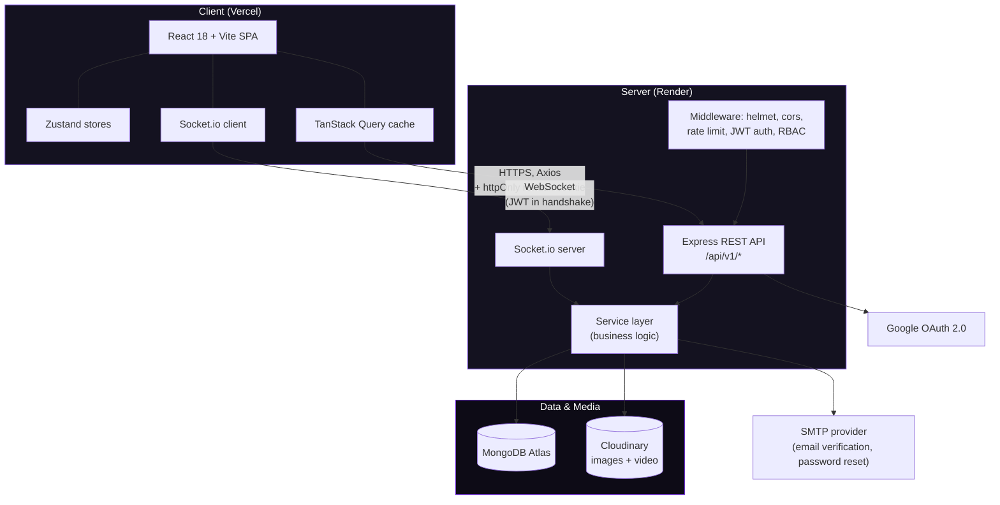
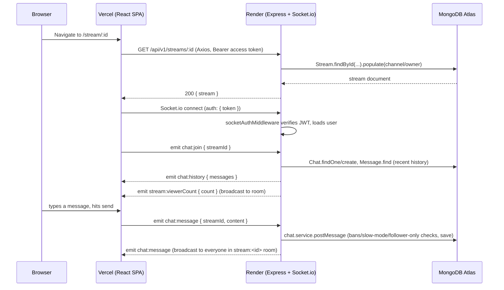
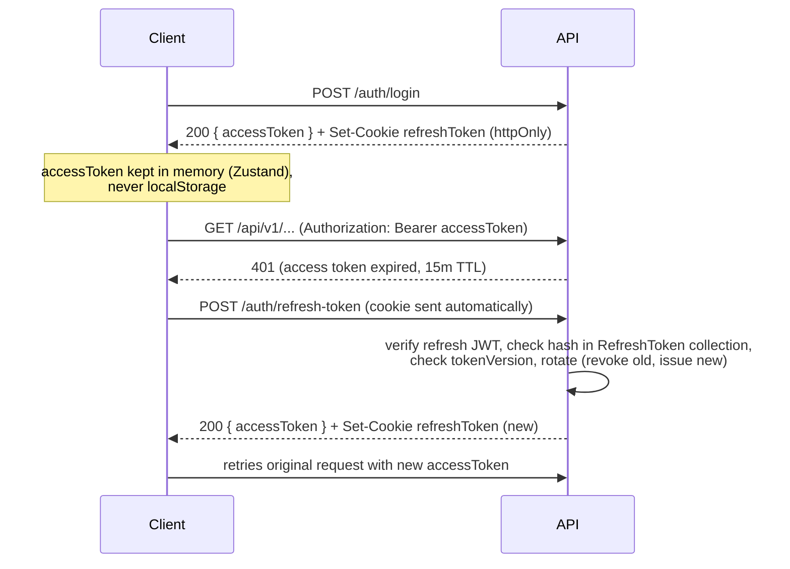

# StreamVerse — Architecture Diagram

## System overview

## Request lifecycle: watching a live stream and chatting

## Auth token lifecycle

## Deployment topology

- **Frontend**: Vercel, static build of `client/` (`vite build` output), SPA rewrites via `client/vercel.json` so React Router handles all paths client-side.
- **Backend**: Render web service, `server/` as root directory, `render.yaml` blueprint provisions env vars and the `/health` check.
- **Database**: MongoDB Atlas, free M0 cluster is sufficient for this project's scale.
- **Media storage**: Cloudinary, used for avatars, banners, thumbnails, and video files (no media ever touches Render's ephemeral filesystem).
- **CORS/cookies**: `CLIENT_URL` env var on the backend drives both the CORS `origin` and the refresh-cookie `sameSite`/`secure` flags (`none`/`true` in production) so the cross-origin Vercel <-> Render cookie flow works over HTTPS.
